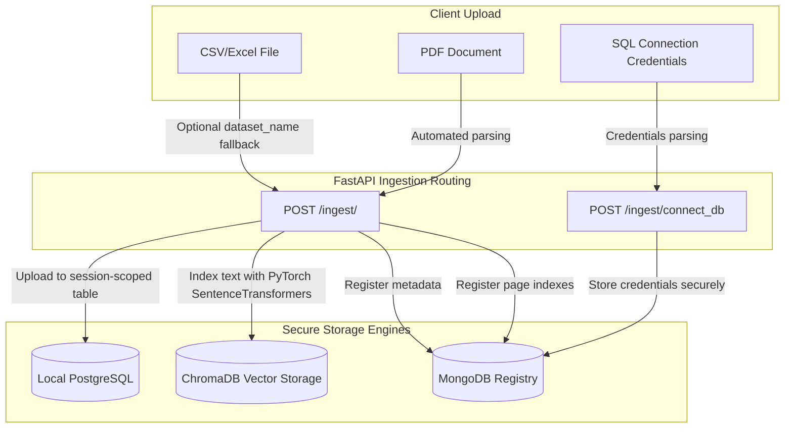
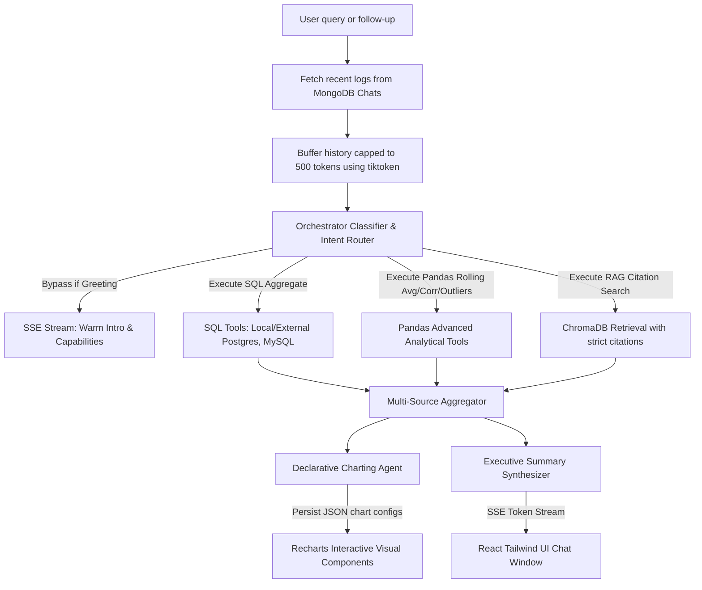

#  🐒 Insight Monkey — Secure AI Insights Assistant

Insight Monkey is a state-of-the-art, secure, multi-source enterprise business intelligence and analytics assistant. Built to combine structured relational data, unstructured document text (PDFs), and uploaded spreadsheets (CSV/Excel) within high-integrity private sessions, it empowers executives and analysts to extract decision-ready insights, compute critical temporal business metrics, and generate beautiful interactive charts—all within a single private and secure AI conversation.

---

## 🏗️ Core Architecture & Data Flow

Insight Monkey is designed around two major decoupled pipelines: **Data Ingestion** and **Conversational Orchestration & Synthesis**. Both run seamlessly with full, session-scoped isolation.

### 1. Ingestion Pipeline
This pipeline standardizes and securely indexes files and databases to make them instantly accessible by specialized analytical tools:


### 2. Multi-Turn Stream Synthesis Pipeline
Insight Monkey utilizes a capability-driven routing engine that acts as an expert orchestrator to coordinate structured and unstructured tools:


---

## ⚡ Key Features

*   **Precise Conversational Memory (Tiktoken-Capped Buffer):** The Orchestrator and Synthesizer analyze recent chat interactions up to a strict **500-token window** (precisely calculated using `tiktoken` for `gpt-4o-mini` token schemas) to ensure prompt memory and state preservation.
*   **LLM Conversational Router & Off-Topic Refusal Policy:** Greetings and questions about capabilities, system structure, or connected data sources are routed through a fast, conversational LLM classifier to bypass tool execution. If a user tries to wander off-topic (e.g., asking for creative stories, poems, coding requests, recipes, or essays), the model politely refuses, keeping conversations strictly tied to data analytics.
*   **Dynamic, Contextual Introductions:** The assistant greets the user warmly, introducing itself as "Insight Monkey" and clearly explaining that it has full access to the datasets and connections loaded in the active session on the right-hand panel.
*   **Lazy Session Instantiation:** Resolves the "ghost session" landing page bug. Sessions are initialized lazily upon the user's first query submission or connection of a datasource, ensuring clean session databases.
*   **Static Right Sidebar & Workspace Clearing Fix:** The right sidebar remains visible statically across all conversation tab views. When the user clicks **New Session**, the workspace successfully clears to the landing page without reverting to previous sessions.
*   **Seamless Ingestion Names & Deletion Cascades:** Automatically falls back to the filename when a dataset name is not supplied. Deleting a session executes a permanent database cascade to clean MongoDB registries and drop staging tables from PostgreSQL.

---

## 🛠️ Technology Stack

| Layer | Technologies Used | Key Benefits |
| :--- | :--- | :--- |
| **Backend API** | FastAPI, Uvicorn, Python 3.11 | High performance, fully async networking, self-documenting OpenAPI. |
| **Orchestration** | OpenAI API (`gpt-4o-mini` / GPT 5.4 Mini model), `tiktoken` | Advanced tool extraction and multi-turn conversational reasoning. |
| **RAG Engine** | ChromaDB, SentenceTransformers (`all-MiniLM-L6-v2`) | Dense vector search with native text extraction and page citations. |
| **Relational DB** | PostgreSQL, MySQL, SQLAlchemy | Dedicated database hosts for synthetic analytics schemas. |
| **NoSQL / Logs** | MongoDB, Motor (Async) | High-speed storage for chat logs, session registries, and metrics. |
| **Frontend UI** | React 19, Vite, Tailwind CSS v4 | Rapid hot-module replacement, modern flexbox designs, premium themes. |
| **Animations** | Framer Motion | Buttery smooth transitions and micro-interactions. |
| **Data Viz** | Recharts, React-Markdown | Real-time interactive charting and structured executive summaries. |

---

## 🚀 Quick Setup & Run Guide

Insight Monkey comes fully containerized with Docker Compose to spin up your APIs, state stores, and frontend clients with a single command.

### Prerequisites
*   [Docker Desktop](https://www.docker.com/products/docker-desktop/) installed on your host system.
*   An active `OPENAI_API_KEY` pasted inside your `.env` file at the root directory:
    ```bash
    OPENAI_API_KEY=your_openai_api_key_here
    ```

### Running with Docker Compose (Recommended)
This command boots up **5 isolated service containers** mapped to standard internal network ports:
1.  `mongodb` (NoSQL chat logs & registry - Port 27017)
2.  `postgres` (Primary storage - Port 5432)
3.  `postgres_movies` (Movies DB - Port 5433)
4.  `postgres_automotive` (Automotive DB - Port 5434)
5.  `mysql_ecommerce` (Ecommerce DB - Port 3307)
6.  `api` (FastAPI backend - Port 8000)

```bash
# 1. Spin up all containers in detached mode
docker-compose up --build -d

# 2. Check service health
curl http://localhost:8000/health
```

---

## 📥 Ingestion & Databases Guide

### Structured SQL Databases
We host 3 pre-configured relational databases with persistent volumes. 

> [!IMPORTANT]
> **Docker Network Hostname Warning:**
> Since both the FastAPI backend (`api` container) and database servers run inside the Docker network, **you must use the internal Docker container names as the "Host" and internal ports (e.g. `5432` or `3306`) in the frontend UI** rather than `localhost`. 
> 
> Using `localhost` will result in a `Connection refused` error because the backend container will try to connect to itself instead of the database container!

To connect to these databases in a session, use the **Add Data Source** form in the frontend sidebar, or send a `POST /ingest/connect_db` request with the following parameters:

#### 🎬 1. Movies Database (PostgreSQL)
* **Option A: External (Local Machine / GUI / Local Backend Host)**
  * **Source Type**: `PostgreSQL Database`
  * **Host**: `localhost`
  * **Port**: `5433`
  * **Database Name**: `movies_db`
  * **Username**: `movie_user`
  * **Password**: `movie_password`
* **Option B: Internal (Docker Network Context)**
  * **Source Type**: `PostgreSQL Database`
  * **Host**: `postgres_movies`
  * **Port**: `5432`
  * **Database Name**: `movies_db`
  * **Username**: `movie_user`
  * **Password**: `movie_password`

#### 🚗 2. Automotive Database (PostgreSQL)
* **Option A: External (Local Machine / GUI / Local Backend Host)**
  * **Source Type**: `PostgreSQL Database`
  * **Host**: `localhost`
  * **Port**: `5434`
  * **Database Name**: `automotive_db`
  * **Username**: `automotive_user`
  * **Password**: `automotive_password`
* **Option B: Internal (Docker Network Context)**
  * **Source Type**: `PostgreSQL Database`
  * **Host**: `postgres_automotive`
  * **Port**: `5432`
  * **Database Name**: `automotive_db`
  * **Username**: `automotive_user`
  * **Password**: `automotive_password`

#### 🛒 3. Ecommerce Database (MySQL)
* **Option A: External (Local Machine / GUI / Local Backend Host)**
  * **Source Type**: `MySQL Database`
  * **Host**: `localhost`
  * **Port**: `3307`
  * **Database Name**: `ecommerce_db`
  * **Username**: `ecommerce_user`
  * **Password**: `ecommerce_password`
* **Option B: Internal (Docker Network Context)**
  * **Source Type**: `MySQL Database`
  * **Host**: `mysql_ecommerce`
  * **Port**: `3306`
  * **Database Name**: `ecommerce_db`
  * **Username**: `ecommerce_user`
  * **Password**: `ecommerce_password`

---

## 📊 Business Analyst How-To Guide

Here is a typical flow of how to use **Insight Monkey** directly from the premium frontend user interface:

### 1. Start a Session & Create Conversations
1. Open the web interface in your browser (typically `http://localhost:5173`).
2. Click **"New Session"** in the left sidebar to spin up a fully isolated private environment.
3. Your active conversation timeline will load instantly, ready for interactive query streaming.

### 2. Connect Your Data Sources (CSV, Excel, PDF)
1. On the right-hand side, click the **"Manage Sources"** button in the **Data Sources** panel.
2. Select your file type from the dropdown (such as `CSV File`, `Excel Spreadsheet`, or `PDF Document`).
3. Drag-and-drop or click to upload your files (such as `marketing_spend.csv` or `quarterly_report.pdf`) from your system.
4. Click **"Connect Source"** to securely index it into your session.

### 3. Link Relational SQL Databases
1. In the same **"Manage Sources"** panel, choose `PostgreSQL Database` or `MySQL Database` from the type selector.
2. Enter your connection credentials (such as **Host**, **Port**, **Database Name**, **Username**, and **Password**).
3. Click **"Connect Source"**. The system will dynamically introspect the database schemas and list them on your sidebar for immediate analytical querying.

### 4. Ask Context-Rich Questions & Generate Charts
Type questions directly in the chat window, such as:
*   *"Which titles performed best in 2025 according to our quarterly report?"* (Searches PDFs and provides page citations)
*   *"Can you plot a rolling average of marketing spend?"* (Computes rolling averages and displays an interactive Recharts area graph)
*   *"Is there a correlation between CTR and sales conversions?"* (Triggers cross-dataset correlation analysis)

---

## 🔒 Assumptions & Architectural Tradeoffs

*   **Off-Topic Query Filtering**: Rather than relying on fragile keyword checkers, we deploy a fast, cheap classification call to analyze user queries. This ensures all off-topic requests (stories, essays, coding, recipes) are securely refused, while greetings and general chitchat are handled gracefully.
*   **Vector Search Scope**: ChromaDB vector storage is containerized and indexed per `session_id`. This guarantees blazing-fast, isolated vector retrieval speeds.
*   **Pandas-in-Worker Execution**: Standard analytical calculations (correlation coefficients, rolling trends, outlier detection) run in isolated Python processes using Pandas, keeping the primary SQL database free of heavy statistical computation overhead.
*   **Session Isolation**: Data is separated securely using session IDs. Deleting a session clears all connected datasets from PostgreSQL, text indexes from MongoDB, chunks from ChromaDB, and its entire conversational chat log cleanly.

---

*Insight Monkey is crafted with 💖 by **[Anuj Mankumare](https://www.linkedin.com/in/mankumare-anuj)**. Explore the source on **[GitHub](https://github.com/PRIME-07/Futures-First)**.*
